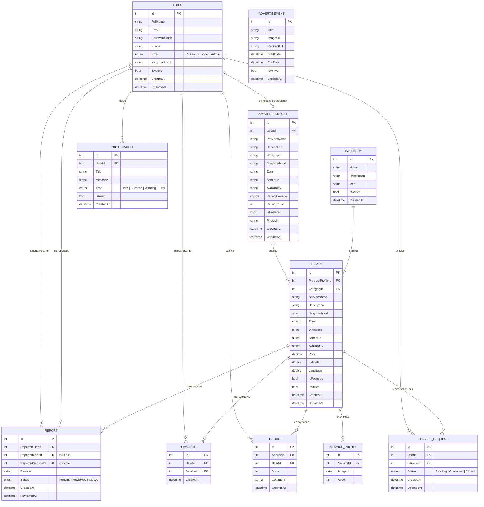

# Modelo Entidad-Relación — VeciLink

## 1. Introducción

Este documento presenta el Modelo Entidad-Relación (MER) del sistema **VeciLink**, una plataforma web diseñada para conectar ciudadanos con prestadores de servicios dentro de su barrio. El modelo describe la estructura de datos que soporta las funcionalidades principales del sistema: gestión de usuarios y roles, publicación y búsqueda de servicios, calificaciones, favoritos, solicitudes de servicio, reportes, notificaciones y publicidad.

---

## 2. Modelo Entidad-Relación

---

## 3. Descripción del Modelo

### 3.1 Entidades principales

| Entidad | Descripción |
|---|---|
| **User** | Representa a todos los usuarios del sistema. El campo `Role` distingue entre Ciudadano, Prestador y Administrador. |
| **ProviderProfile** | Perfil extendido exclusivo para usuarios con rol Prestador. Contiene datos comerciales, ubicación y métricas de calificación agregadas. |
| **Category** | Catálogo de categorías que clasifican los servicios ofrecidos (ej. plomería, electricidad, limpieza). |
| **Service** | Servicio publicado por un prestador, asociado a una categoría. Incluye ubicación geográfica, precio y disponibilidad. |
| **ServicePhoto** | Fotografías asociadas a un servicio, con orden de visualización. |
| **ServiceRequest** | Solicitud que un ciudadano realiza a un servicio. Sigue un flujo de estados: Pendiente → Contactado → Cerrado. |
| **Rating** | Calificación (1-5 estrellas) y comentario opcional que un usuario deja sobre un servicio. |
| **Favorite** | Relación que permite a un usuario marcar servicios como favoritos para acceso rápido. |
| **Report** | Reporte de conducta inapropiada hacia un usuario o un servicio. Puede apuntar a un usuario, a un servicio, o a ambos. |
| **Notification** | Notificación enviada a un usuario, con tipo (informativa, éxito, advertencia, error) y estado de lectura. |
| **Advertisement** | Publicidad con imagen, URL de redirección y rango de fechas de vigencia. Entidad independiente. |

### 3.2 Relaciones clave

| Relación | Cardinalidad | Descripción |
|---|---|---|
| User → ProviderProfile | 1 : 0..1 | Un usuario puede tener como máximo un perfil de prestador. Solo aplica para usuarios con rol `Provider`. |
| ProviderProfile → Service | 1 : N | Un prestador publica uno o más servicios. |
| Category → Service | 1 : N | Cada servicio pertenece a exactamente una categoría. |
| Service → ServicePhoto | 1 : N | Un servicio puede tener múltiples fotografías. |
| User → ServiceRequest | 1 : N | Un ciudadano puede generar múltiples solicitudes de servicio. |
| Service → ServiceRequest | 1 : N | Un servicio puede recibir múltiples solicitudes. |
| User → Rating / Service → Rating | N : N (a través de Rating) | Un usuario califica servicios; un servicio recibe calificaciones de múltiples usuarios. |
| User → Favorite / Service → Favorite | N : N (a través de Favorite) | Relación muchos a muchos entre usuarios y servicios favoritos. |
| User → Report | 1 : N | Un usuario puede generar múltiples reportes, y también puede ser reportado. |
| Service → Report | 1 : N | Un servicio puede ser objeto de múltiples reportes. |
| User → Notification | 1 : N | Un usuario recibe múltiples notificaciones. |

### 3.3 Lógica general del modelo

- **Roles sin tabla separada:** el rol del usuario se gestiona mediante un enumerador (`Citizen`, `Provider`, `Admin`) directamente en la entidad `User`, evitando una tabla adicional.
- **Perfil de prestador separado:** la información comercial del prestador se mantiene en `ProviderProfile`, vinculada 1:1 con `User`, lo que permite que la tabla de usuarios se mantenga liviana.
- **Reportes flexibles:** la entidad `Report` permite reportar tanto usuarios como servicios mediante claves foráneas opcionales (`ReportedUserId`, `ReportedServiceId`).
- **Publicidad independiente:** `Advertisement` no depende de ningún usuario ni servicio, lo que permite gestionar banners publicitarios de forma autónoma.
- **Calificaciones y favoritos como tablas intermedias:** `Rating` y `Favorite` actúan como tablas de unión que resuelven la relación muchos a muchos entre `User` y `Service`, cada una con atributos propios.
